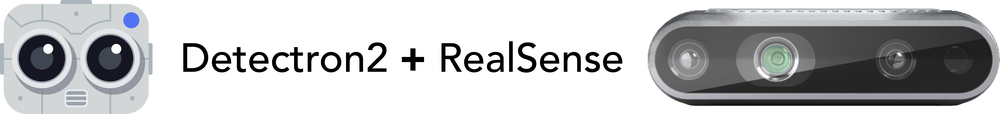
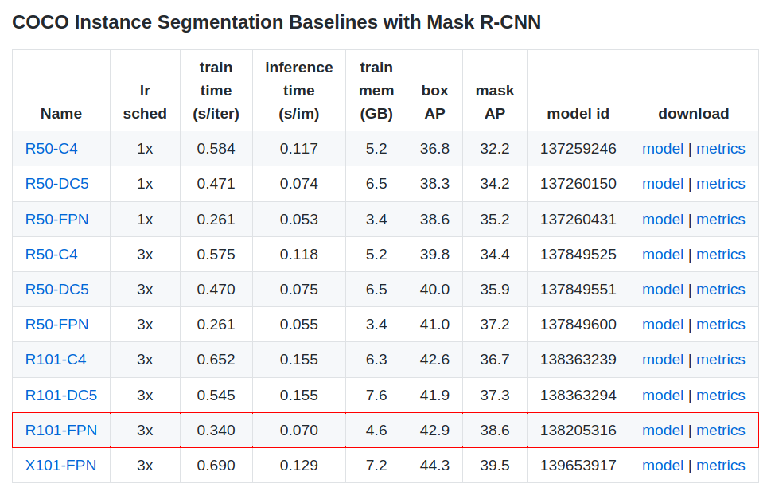
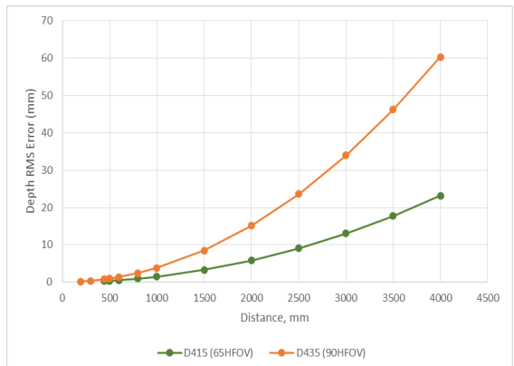
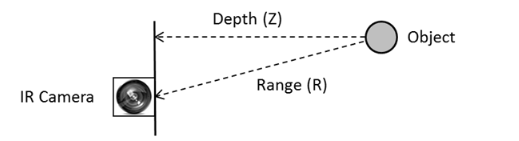
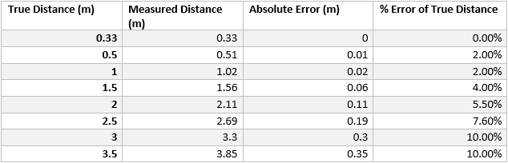
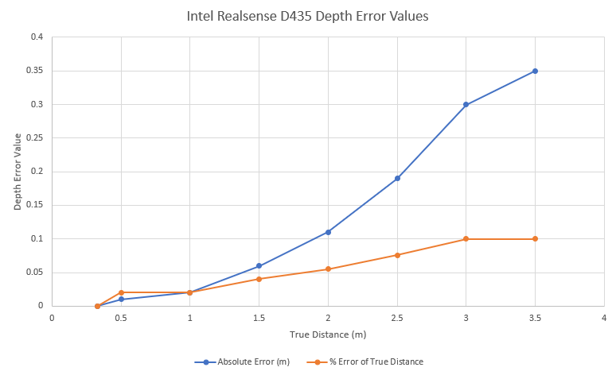

This is a work based on [ErikGDev-InstanceSeg-Mac/Linux](https://github.com/ErikGDev/instance-segmentation), which is a fork of [Facebook AI Research's](https://github.com/facebookresearch) implementation of [Mask R_CNN](https://arxiv.org/abs/1703.06870), Detectron2. Detectron2 is a complete write-up from its previous version
[Detectron](https://github.com/facebookresearch/Detectron/), which originates from [maskrcnn-benchmark](https://github.com/facebookresearch/maskrcnn-benchmark/). This Mask R_CNN implementation is powered by [PyTorch](https://pytorch.org) and is based on **Feature Pyramid Network (FPN) and a ResNet101** backbone. (PS: You may also check MMsegmentation at [here](https://github.com/open-mmlab))

In this project, like its [reference](https://github.com/ErikGDev/instance-segmentation), real-time RGB video and depth map or RGB-D from a [Intel® RealSense™ D435 camera](https://www.intelrealsense.com/depth-camera-d435/) are inputted into Detectron2's Mask R_CNN model. The output is ("almost") real-time video (2-4fps with CUDA enabled in my case) with instance segmentation masks and labels superimposed. The feature of this project is that the median depth values of each object are also outputted. It runs in Windows10.


## 1. Usage

**Requirements/Dependencies**

- Windows10 (You can find the solution for Linux or macOS [here](https://github.com/ErikGDev/instance-segmentation))
- Python ≥ 3.6
- PyTorch ≥ 1.3
- [torchvision](https://github.com/pytorch/vision/) that matches the PyTorch installation.
	You can install them together at [pytorch.org](https://pytorch.org) to make sure of this. Please ensure that your version of CUDA is also compatible when installing. You can run this code without CUDA, but it will be much slower, e.g. 10x slower but not really test it.
- OpenCV `pip3 install opencv-python`
- Intel RealSense SDK 2.0 Installation: [here](https://www.intelrealsense.com/sdk-2/)
- PyRealSense `pip3 install pyrealsense2`
- Build Detectron2:
  + **Build Detectron2 from Source**

     [Windows] Install Visual C++ Build tools form [this link](https://answers.microsoft.com/en-us/windows/forum/windows_10-windows_install/microsoft-visual-c-140-is-required-in-windows-10/f0445e6b-d461-4e40-b44f-962622628de7).  Then restart your PC, then you also need to upgrade Python setup tools, by running this command: `pip3 install --upgrade setuptools`.

     Then you can install Detectron2 from source by running:
     ```bash
     [Note: This should be the easiest way to build Detectron2 in Windows10!]
     pip install git+https://github.com/facebookresearch/detectron2.git
     # (add --user if you don't have permission)

     # Or, to install it from a local clone:
     git clone https://github.com/facebookresearch/detectron2.git
     cd detectron2 && pip3 install -e .

     # Or if you are on macOS
     # CC=clang CXX=clang++ pip install -e .
     ```

     If the installation is not proper, you may see the error of "cannot import name '_C' #157" when running the `main_xxx.py`.

     For more details on the installation of Detectron2 and its dependencies, please refer to the [official Detectron2 GitHub](https://github.com/facebookresearch/detectron2).

**After Installation**

1. Clone or download this repository.
2. To perform instance segmentation straight from a D435 camera attached to a USB port:
  * Run one of the two python files i.e. `main_xxx_win10.py`
  * If using .bag files:
    * Type 'python3 main_xxx_win10.py --file={filename}' where {filename} is the name of the input .bag file. To create .bag files, use d435_to_file.py in [this repository](https://github.com/ErikGDev/instance-segmentation/tree/master/tools).

---

_(For conveniently recalling the background, I here copy and paste most of the content from [this awesome rep](https://github.com/ErikGDev/instance-segmentation) as below.)_
## 2. Accuracy and Specifications of Model

### 2.1 Instance Segmentation Validation Results

|  | Backbone | AP | AP<sub>50</sub> | AP<sub>75</sub> | AP<sub>S</sub> | AP<sub>M</sub> | AP<sub>L</sub> |
| :--- | :--- | :---: | :---: | :---: |  :---:  | :---: | :---: |
| Original Mask R-CNN   | ResNet-101-FPN  | 35.7 | 58.0 | 37.8 | 15.5 | 38.1 | 52.4 |
| Matterport Mask R-CNN | ReSNet-101-FPN | 38.0 | 55.8 | <b>41.3</b> | 17.9 | <b>45.5</b> | <b>55.9</b> |
| Detectron2 Mask R-CNN | ReSNet-101-FPN | <b>38.6</b> | <b>60.4</b> | <b>41.3</b> | <b>19.5</b> | 41.3 | 55.3 |

Validation tests were perfomed on the segmentation masks created on the **2017 COCO** validation dataset. The standard COCO validation metrics include average AP over IoU thresholds, AP<sub>50</sub>, AP<sub>75</sub>, and AP<sub>S</sub>, AP<sub>M</sub> and AP<sub>L</sub> (AP at different scales). These results were then compared to COCO validation results from the [original paper](https://arxiv.org/abs/1703.06870) and a popular [Mask R-CNN implementation by Matterport](https://github.com/matterport/Mask_RCNN). Clearly, Detectron2's Mask R_CNN outperforms the original Mask R_CNN and Matterport's Mask R_CNN with respect to average precision. It also outperformed SOTA COCO segmentation competition winners from the [2015 and 2016 challenge](http://cocodataset.org/#detection-leaderboard).

### 2.2 Why this model?

Detectron2's Mask R_CNN with a **ReSNet-101-FPN** backbone was determined to be the optimal model. Upon comparing Detectron2 to [MMDetection's models](https://github.com/open-mmlab/mmdetection/blob/master/docs/MODEL_ZOO.md), which won first place in the [2018 segmentation COCO challenge](http://cocodataset.org/#detection-leaderboard), it is evident that the choice of model is appropriate for high-speed real-time video.

When comparing [Detectron2's Mask R_CNN](https://github.com/facebookresearch/detectron2/blob/master/MODEL_ZOO.md#coco-instance-segmentation-baselines-with-mask-r-cnn) to [MMDetection's Mask R_CNN](https://github.com/open-mmlab/mmdetection/blob/master/docs/MODEL_ZOO.md#mask-r-cnn), Detectron2 outperforms in both mask AP (38.6 vs 35.9) and inference time (0.070 s/im vs 0.105 s/im). MMDetectron does have models that are slightly more accurate than Detectron2's Mask R_CNN implementation, such as [the Hybrid Task Cascade model (HTC)](https://github.com/open-mmlab/mmdetection/blob/master/docs/MODEL_ZOO.md#hybrid-task-cascade-htc) however these often result in models that output masks at less than 4 fps. When adding the time to ouput the superimposed images, this would be insufficient for real-time.

Detectron2's Model Zoo displays the inference time and Mask AP for each model provided. For the Mask R_CNN models, the FPN model with a ResNet101 backbone has the best Mask AP for the short time it takes for inferences.




### 2.3 Config Settings

Config settings can be altered.

+ The `SCORE_THRESHOLD` or `cfg.MODEL.ROI_HEADS.SCORE_THRESH_TEST` line specifies the lower threshold for when the instance segmentation mask is shown to the user. For example, set `SCORE_THRESHOLD=0.65` or `cfg.MODEL.ROI_HEADS.SCORE_THRESH_TEST = 0.65`. If Detectron2 is at least 65% confident the object detected belongs to a class name, the mask is superimposed onto the image.

+ The `cfg.MODEL.WEIGHTS` line specifies the pretrained weights used to perform instance segmentation. This program uses the `ResNet101 FPN` weights.

+ The `cfg.INPUT.MIN_SIZE_TEST` line specifies the size of the smallest size of the image during testing/inference. If this is set to `0`, resizing is disabled.

+ The `RESOLUTION_X`(i.e. `640`, `1280`) and `RESOLUTION_Y`(`360`(BW:cannot work in this PC, min:`480`),`480`, `720`) specify the resolution of camera streams from D435.


## 3. Intel® RealSense™ D435 RGB-D Camera

According to Intel's paper, [Best-Known-Methods for Tuning Intel® RealSense™ D400 Depth Cameras for Best Performance](https://www.intelrealsense.com/wp-content/uploads/2019/11/BKMs_Tuning_RealSense_D4xx_Cam.pdf), The depth RMS (root mean square) error increases rapidly when placing objects further away, especially when the distance is greater than 3m. The orange line on the graph below represents the depth RMS error on a D435 with HFOV=90deg, Xres=848, baseline=50mm and for subpixel=0.08.



### 3.1 Depth Error Testing

Testing was performed on this program, where the real distances of objects from the D435 were compared to the distance measured by the stereo sensors on the D435. The true distance was found by measuring the distance between a box (with a flat front) and the parallel plane of the imagers.



from [Intel D400 Datasheet](https://www.mouser.ca/pdfdocs/Intel_D400_Series_Datasheet.pdf)

The D435 recordings were measured on the [realsense-viewer](https://github.com/IntelRealSense/librealsense/tree/master/tools/realsense-viewer) program. The stereo resolution was set to 1280 x 720. Rather than the depth RMS error, the absolute depth error was compared to the real distance of the object to the D435.



This graph shows that the absolute error appears to exponentially increases when the distance increases. This means the depth recordings will be most accurate when the object is closer to the camera.

### 3.2 When does the Object Record 0m?

When the object is too close to the camera, the depth values will return 0m. This threshold is known as `MinZ`. The formula for calculating `MinZ` is

> MinZ(mm) = focal length(pixels) x Baseline(mm)/126

Therefore with a depth resolution of 848x480, the MinZ is ~16.8cm. If the object is within this distance, no value is returned.

Similar to MinZ, MaxZ exists too. For the D435, the MaxZ is [approximately 10m](https://ark.intel.com/content/www/us/en/ark/products/128255/intel-realsense-depth-camera-d435.html). Any object outside this range will also be recorded as 0m.

Sometimes objects can be recorded as 0m even though they are inside the MinZ and MaxZ threshold. This usually occurs when there is too much noise on the depth image. This can occur when the target is not well textured. For more information on how to configure the D435 for specific environments and objects, refer to [this paper](https://www.intelrealsense.com/wp-content/uploads/2019/11/BKMs_Tuning_RealSense_D4xx_Cam.pdf).

### 3.3 How is each Depth Value Calculated?

To find the distance of each object, the median depth pixel is used. All pixels associated to the object are abstracted to a histogram with a max distance of 10m (Max range of the D435), and 500 bins. The bins are looped through until the bin which contains the median is found. This means that the depth values will change with intervals of 0.02m.

For smaller intervals of 0.01m, change the NUM_BINS constant to 1000, and change

`centre_depth = "{:.2f}m".format(x / 50)`
to
`centre_depth = "{:.2f}m".format(x / 100)`


## 4. Object Tracking (note:exclude this part for speed up if not necessary)

The purpose of this project is to propose where objects exists in the environment around a robot. In addition to this, it would be ideal to understand the movement of each object.

### 4.1 Simple Online and Real-time Tracking (SORT)

The velocity, linear speed (between camera and object), and time to impact were all calculated using an altered version of [Chris Fotache's implementation of SORT with PyTorch](https://github.com/cfotache/pytorch_objectdetecttrack), created by [Alex Bewley](https://github.com/abewley/), Zongyuan Ge, Lionel Ott, Fabio Ramos and Ben Upcroft.

Simple Online and Real-time Tracking (SORT) paper: https://arxiv.org/abs/1602.00763</br>
Original python implementation of SORT by Alex Bewley: https://github.com/abewley/sort

SORT proposes using a Kalman filter to predict the trajectory of previously identified objects, and then match them with newly identified objects. In this program, when an object is matched with a detection, the real-world position and distance from camera are added as attributes to the KalmanBoxTracker object. When the same object is tracked to the next frame, linear speed, velocity, real-world distance, and time until impact are all added under the same object. Each KalmanBoxTracker is added to the appropriate DetectedObject as the attribute DetectredObject.track. This means all the data can be passed to an API using a single DetectedObject.

### 4.2 Velocity Vector Arrows

Optionally, vector arrows can be superimposed on the image. These vector arrows show the direction the object is moving in 3D space. Each arrow is represented through the Arrow3D class, which essentially is the same as the FancyArrowPatch class from matplotlib, with additional 3D support.
